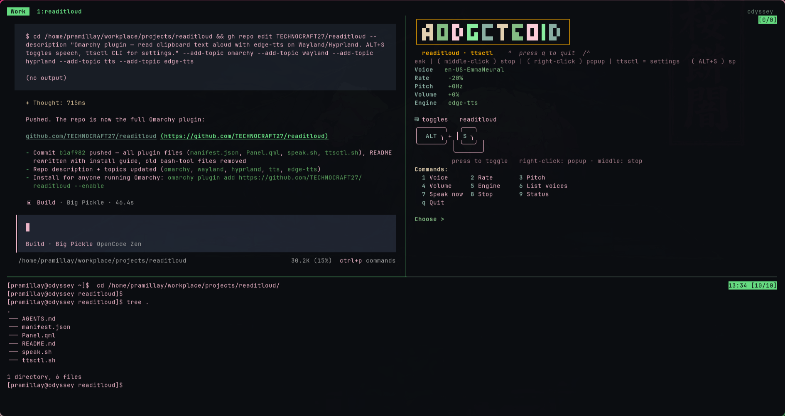

# readitloud

Read clipboard text aloud on Wayland/Hyprland — press **ALT+S** (or click the TTS
bar icon) → clipboard selection is synthesized with `edge-tts` (or `espeak-ng`
fallback) and played through `mpv`; press again to stop.

**readitloud is an Omarchy plugin** (`readitloud.tts`, a bar widget) developed
live on this machine at `~/.config/omarchy/plugins/readitloud.tts/`.

co-writer by opencode


## Installation

```bash
# add the plugin (run from where this repo is cloned)
omarchy plugin add /path/to/readitloud --enable

# or, if the plugin dir is already in place:
omarchy plugin enable readitloud.tts right
```

### Keybinding

Set in `~/.config/hypr/bindings.lua` (never raw `bind =` lines):

```lua
o.bind("ALT + S", "Read selection aloud", "omarchy-shell shell toggle readitloud.tts")
```

## Manual setup

**This plugin requires manual setup.** It ships no speech engine and installs
nothing on your behalf: no `sudo`, no `pkexec`, no package manager invocation,
not even a "would you like to install this?" prompt. You install the
dependencies yourself with the commands below, then verify with
`ttsctl doctor`.

If a dependency is missing the plugin degrades instead of failing silently:
the bar widget popup shows **Setup required** with what is missing, ALT+S
refuses with a notification, and `ttsctl doctor` prints the full report with
the install command for your distribution.

```bash
ttsctl doctor   # read-only: reports what is missing, installs nothing
```

### Required system packages

| Package | Why |
|---------|-----|
| `wl-paste` | reads the Wayland clipboard |
| `mpv` | plays the synthesized audio (both engines) |
| `espeak-ng` | offline speech engine — required for `engine: espeak-ng` |

`jq`, `socat` and `libnotify` (`notify-send`) are optional: they add the
progress bar and desktop notifications, and are listed as "optional, not
installed" by `ttsctl doctor` when absent.

### Install commands

Pick your distribution. Run these yourself; the plugin never runs them.

**Omarchy / Arch**
```bash
omarchy pkg add wl-paste mpv espeak-ng        # honours passwordless sudo
omarchy pkg add jq socat libnotify             # optional extras
```

**Debian / Ubuntu**
```bash
sudo apt install wl-clipboard mpv espeak-ng
sudo apt install jq socat libnotify-bin        # optional extras
```

**Fedora**
```bash
sudo dnf install wl-clipboard mpv espeak-ng
sudo dnf install jq socat libnotify            # optional extras
```

**NixOS**
```bash
programs.wl-clipboard.enable = true;
programs.mpv.enable = true;
programs.espeak-ng.enable = true;
```

### Online engine (optional): `edge-tts`

The default engine is Microsoft Edge's online TTS, which needs a Python
package. It is installed into a **user-owned virtual environment**, so no root
is involved and it cannot conflict with system Python:

```bash
python -m venv ~/.local/share/tts-venv
~/.local/share/tts-venv/bin/pip install edge-tts
```

Why a venv rather than a system or AUR install:

- no elevated privileges needed
- no conflict with system Python packages
- removal is `rm -rf ~/.local/share/tts-venv`
- the AUR `python-edge-tts` package is abandoned, so the venv is the
  maintained route

Without it the widget still works — see offline mode below.

### Offline mode

`espeak-ng` needs no network and no Python at all:

```bash
ttsctl set engine espeak-ng
```

`rate`, `pitch` and `volume` are translated onto espeak-ng's own scales, so
the settings still apply offline.

## Removal

```bash
omarchy plugin remove readitloud.tts
```

This removes the plugin from `~/.config/omarchy/plugins/` and its entry in
`~/.config/omarchy/shell.json`.

### Complete Cleanup

To fully remove all traces, including dependencies and temporary files:

```bash
rm -f ~/.local/bin/ttsctl                 # settings CLI symlink
# remove the o.bind("ALT + S", ...) line from ~/.config/hypr/bindings.lua
rm -rf ~/.local/state/readitloud          # PID file, audio, IPC socket, temp text
rm -f /tmp/speaking-status                # status marker for external bars
rm -rf ~/.local/share/tts-venv            # removes edge-tts and its venv
```

## Usage

1. **Copy text** to the clipboard (select + Ctrl+C, or `wl-copy`)
2. **Press ALT+S** (or left-click the TTS icon) — starts speaking
3. **Press ALT+S again** (or middle-click) — stops
4. **Right-click** the icon — status/settings popup; **Settings…** opens `ttsctl`

## Settings

**`ttsctl`** is the settings/control CLI (symlinked to `~/.local/bin/ttsctl`):

```
ttsctl               interactive menu
ttsctl show          current settings
ttsctl set <key> <val>   set voice, rate, pitch, volume or engine
ttsctl voices        list available edge-tts voices
ttsctl doctor        report missing dependencies (read-only)
ttsctl speak         speak clipboard now (manual test)
ttsctl stop          stop speaking
ttsctl status        is speaking?
```

Settings are written to the `readitloud.tts` entry in
`~/.config/omarchy/shell.json` and hot-reload into the widget.

| Setting | Example values |
|---------|----------------|
| `voice` | `en-IN-NeerjaExpressiveNeural`, `en-US-EmmaNeural` |
| `rate`  | `+0%`, `-10%`, `-20%` (slower) |
| `pitch` | `+0Hz`, `-5Hz` |
| `volume`| `+0%`, `+10%` |
| `engine`| `edge-tts`, `espeak-ng` |

List all voices: `ttsctl voices` (or
`~/.local/share/tts-venv/bin/edge-tts --list-voices | grep Female`).

## File Structure

This repo **is** the plugin source; install it by linking (or `omarchy plugin
add`) this folder into `~/.config/omarchy/plugins/` (the live copy lives at
`~/.config/omarchy/plugins/readitloud.tts/`).

```
readitloud/
├── manifest.json   # plugin manifest (kind: bar-widget, settings defaults)
├── Panel.qml       # Quickshell bar widget + popup (open/close tie to speech)
├── speak.sh        # TTS helper: start/stop/status/progress/check
├── ttsctl.sh       # settings CLI → ~/.local/bin/ttsctl
├── LICENSE         # MIT
├── SECURITY.md     # capabilities and dependency posture
└── README.md       # this file
```

## Security & Privacy

### What This Plugin Accesses
- **Clipboard** (read-only) — only when you press ALT+S
- **Audio output** — via `mpv` for playback
- **Network** (optional) — to Microsoft edge-tts service for speech synthesis
- **Local files** — reads/writes settings to `~/.config/omarchy/shell.json`

### Dependency handling
- **Nothing is installed automatically** — no `sudo`, no `pkexec`, no package
  manager invocation, no install prompts. See [Manual setup](#manual-setup).
- **Python dependencies go in a user-owned venv** (`~/.local/share/tts-venv`) —
  never a system or root Python install.
- **Missing dependencies are reported, not worked around** — `ttsctl doctor`
  and the widget's Setup required state name what is missing and print the
  install command for your distribution.
- **Validation only reads** — `speak.sh check` and `ttsctl doctor` inspect the
  environment and print; they write nothing outside the plugin's own temp files.

### Privacy Options
- **Offline mode available** — Run `ttsctl set engine espeak-ng` to use entirely offline text-to-speech (no network requests)
- **No data collection** — This plugin doesn't collect, log, or send usage data beyond the TTS synthesis itself
- **Clipboard content** — Text you copy is sent to the TTS provider as-is (edge-tts or local espeak-ng). Use offline mode to keep clipboard data local.

### Code Safety
- `ttsctl set voice ...` values are passed as arguments to `edge-tts` / `espeak-ng` — **no shell evaluation**
- All clipboard operations use `wl-paste` (safe Wayland clipboard API)
- No privilege escalation — no `sudo` required after installation

### Open Source & Licensed
- Full source code: [github.com/TECHNOCRAFT27/readitloud](https://github.com/TECHNOCRAFT27/readitloud)
- Licensed under **MIT** — review the LICENSE file for full terms

## Troubleshooting

**ALT+S does nothing** (widget failed to load):
```bash
journalctl --user -u omarchy-shell -f | rg -i "readitloud|error|failed"
# e.g. "Cannot assign to non-existent property" → QML error → rm -rf ~/.cache/quickshell/qmlcache/* && omarchy restart shell
```

**Stale behavior after editing Panel.qml**:
```bash
rm -rf ~/.cache/quickshell/qmlcache/*
omarchy restart shell
```

**No audio / no speech**: start with the dependency report
```bash
ttsctl doctor
```
then test the pieces manually:
```bash
~/.local/share/tts-venv/bin/edge-tts -v en-IN-NeerjaExpressiveNeural -t "test" --write-media /tmp/test.mp3
mpv /tmp/test.mp3
which jq mpv wl-paste
```

**"Setup required" in the popup**: `ttsctl doctor` lists what is missing;
install it yourself with the command it prints (see
[Manual setup](#manual-setup)).

## License

MIT
